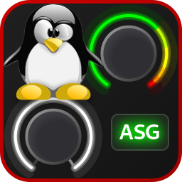
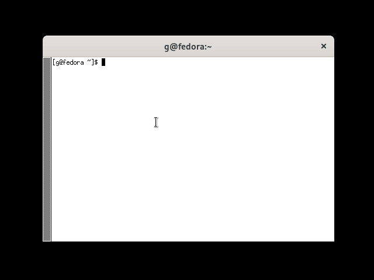

# ALSA Scarlett2 Control Panel (`alsa-scarlett-gui`)

`alsa-scarlett-gui` is a Gtk4 GUI for the ALSA controls presented by
the Linux kernel Focusrite Scarlett2 USB Protocol Mixer Driver.

Supported interfaces:
- Scarlett 2nd Gen 6i6, 18i8, 18i20
- Scarlett 3rd Gen Solo, 2i2, 4i4, 8i6, 18i8, 18i20
- Scarlett 4th Gen Solo, 2i2, 4i4
- Clarett 2Pre, 4Pre, 8Pre USB
- Clarett+ 2Pre, 4Pre, 8Pre
- Vocaster One and Vocaster Two

## About

The Focusrite USB audio interfaces are class compliant meaning that
they work “out of the box” on Linux as audio and MIDI interfaces
(although on Gen 3/4/Vocaster you need to disable MSD mode first for
full functionality). However, except for some of the smallest models,
they have a bunch of proprietary functionality that required a kernel
driver to be written specifically for those devices.

Unfortunately, actually using this functionality used to be quite an
awful experience. The existing applications like `alsamixer` and
`qasmixer` become completely user-hostile with the hundreds of
controls presented for the Gen 3 18i20. Even the smallest Gen 3 4i4
interface at last count had 84 ALSA controls.

Announcing the ALSA Scarlett2 Control Panel, now supporting Scarlett
Gen 2, 3, 4, Clarett, and Vocaster!

## Documentation

Refer to [INSTALL.md](docs/INSTALL.md) for prerequisites, how to
build, install, and run.

Refer to [USAGE.md](docs/USAGE.md) for general usage information and
known issues.

Information specific to various models:

- [Scarlett 3rd Gen Solo and 2i2](docs/iface-small.md)

- [Scarlett 2nd Gen 6i6+, 3rd Gen 4i4+, Clarett USB, and
  Clarett+](docs/iface-large.md)

- [Scarlett 4th Gen](docs/iface-4th-gen.md)

## Donations

This program is Free Software, developed using my personal resources,
over hundreds of hours.

If you like this software, please consider a donation to say thank
you! Any donation is appreciated.

- https://liberapay.com/gdb
- https://paypal.me/gdbau

## License

Copyright 2022-2024 Geoffrey D. Bennett

This program is free software: you can redistribute it and/or modify
it under the terms of the GNU General Public License as published by
the Free Software Foundation, either version 3 of the License, or (at
your option) any later version.

This program is distributed in the hope that it will be useful, but
WITHOUT ANY WARRANTY; without even the implied warranty of
MERCHANTABILITY or FITNESS FOR A PARTICULAR PURPOSE.  See the GNU
General Public License for more details.

You should have received a copy of the GNU General Public License
along with this program.  If not, see <https://www.gnu.org/licenses/>.

## Disclaimer Third Parties

Focusrite, Scarlett, Clarett, and Vocaster are trademarks or
registered trademarks of Focusrite Audio Engineering Limited in
England, USA, and/or other countries. Use of these trademarks does not
imply any affiliation or endorsement of this software.
