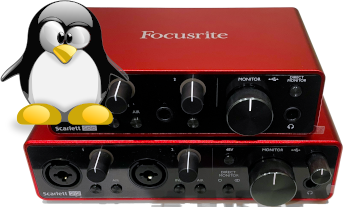

# ALSA Scarlett Gen 2/3 Control Panel (`alsa-scarlett-gui`)

`alsa-scarlett-gui` is a Gtk4 GUI for the ALSA controls presented by
the Linux kernel Focusrite Scarlett Gen 2/3/Clarett USB/Clarett+ Mixer
Driver.

## About

The Focusrite Scarlett (and Clarett+) interfaces are class compliant
USB audio interfaces meaning that they work “out of the box” on Linux
as audio and MIDI interfaces (although on Gen 3 you need to disable
MSD mode first). However, the Gen 2 6i6+, Gen 3 4i4+, Clarett USB, and
Clarett+ interfaces have a bunch of proprietary functionality that
required a kernel driver to be written specifically for those devices.

Linux kernel support (“ALSA Focusrite Scarlett Gen 2/3 Mixer Driver”)
for the proprietary functionality was first added in:
- Gen 2: Linux 5.4
- Gen 3: Linux 5.14
- Clarett+ 8Pre: Linux 6.1
- Clarett 2Pre/4Pre/8Pre USB, Clarett+ 2Pre/4Pre: coming soon

Unfortunately, actually using this functionality used to be quite an
awful experience. The existing applications like `alsamixer` and
`qasmixer` become completely user-hostile with the hundreds of
controls presented for the Gen 3 18i20. Even the smallest Gen 3 4i4
interface at last count had 84 ALSA controls.

Announcing the ALSA Scarlett Gen 2/3 (and Clarett USB/Clarett+!)
Control Panel!

The GUI supports all features presented by the driver (if not, please
report a bug).

## Documentation

Refer to [INSTALL.md](INSTALL.md) for prerequisites, how to build,
install, and run.

Refer to [USAGE.md](USAGE.md) for usage information and known issues.

## Donations

This program is Free Software, developed using my personal resources,
over hundreds of hours. Focusrite did not support the development of
the driver or this control panel in any way. Thanks to Laurent
Debricon who got me started on the Gen 3 drivers by donating a 4i4.

If you like it, please consider a donation to say thank you as it was
expensive to purchase one of each model for development and testing!
Any donation is appreciated.

- https://liberapay.com/gdb
- https://paypal.me/gdbau

## Scarlett Gen 4 Support

Focusrite recently released 3 new "Generation 4" interfaces: Solo,
2i2, and 4i4. I have created a fundraiser to specifically request
assistance purchasing one of each so I can add support for them as
well: https://gofund.me/ae997781

Thank you!

## License

Copyright 2022-2023 Geoffrey D. Bennett

This program is free software: you can redistribute it and/or modify
it under the terms of the GNU General Public License as published by
the Free Software Foundation, either version 3 of the License, or (at
your option) any later version.

This program is distributed in the hope that it will be useful, but
WITHOUT ANY WARRANTY; without even the implied warranty of
MERCHANTABILITY or FITNESS FOR A PARTICULAR PURPOSE.  See the GNU
General Public License for more details.

You should have received a copy of the GNU General Public License
along with this program.  If not, see <https://www.gnu.org/licenses/>.

## Disclaimer Third Parties

Focusrite, Scarlett, and Clarett are trademarks or registered
trademarks of Focusrite Audio Engineering Limited in England, USA,
and/or other countries. Use of these trademarks does not imply any
affiliation or endorsement of this software.
