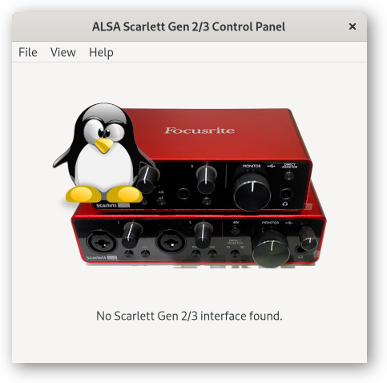
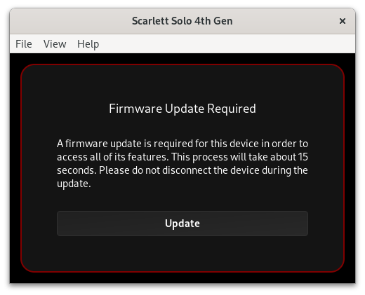
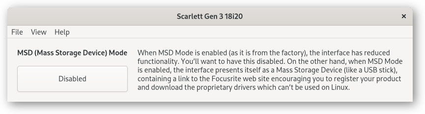

# ALSA Scarlett2 Control Panel Usage

Refer to [INSTALL.md](INSTALL.md) for prerequisites, how to build,
install, and run.

## No interface connected

If no interface is detected (usually because there isn’t one
connected!) you’ll see this window:

Plug in an interface or select the menu option File → Interface
Simulation and load a demo file to make more interesting things
happen.

## First Time Usage

If your interface is fresh out of the box (or you haven’t updated it
using the manufacturer’s software), you may need to update the
firmware and/or disable MSD Mode first.

### Firmware Update Required

Some interfaces require a firmware update before all their
functionality is available. If the firmware is not available on your
system, you’ll see this window:

In this case, click on the link, download and install the firmware
package, then restart `alsa-scarlett-gui`.

If a firmware update is required and the firmware is available, you’ll
see this window:

Click “Update”, then “Yes” to update the firmware.

The update will take about 15 seconds, and then your interface will
restart, showing the main window.

### MSD (Mass Storage Device/Quick Start/Easy Start) Mode

If MSD Mode is enabled (as it is from the factory) and a firmware
update is not available or required, then you’ll see this window:

Click the “Enabled” button to disable MSD Mode, then click “Reboot” to
restart the interface, and in a moment the main window will appear.

## Startup Controls

The View → Startup menu option opens a window to configure settings
that only take effect when the interface is powered on.

The options common to all interfaces are:

- **Reset Configuration**: this will reset the configuration to the
  factory defaults. This is particularly useful with the 4th Gen and
  Vocaster interfaces if you’ve made a mess of the configuration and
  want to start again.

- **Update Firmware**: if a firmware update is found in the
  `/usr/share/firmware/scarlett2` directory, then an option to update
  the firmware will be available here.

## File Menu

The File menu contains options to load and save the configuration,
load a configuration in simulation mode, and to exit the application.

### Load/Save Configuration

The entire state of the interface can be loaded and saved using the
File → Load Configuration and File → Save Configuration menu options.

Internally, this uses `alsactl`:

- **Load**: `alsactl restore USB -f <fn>`
- **Save**: `alsactl store USB -f <fn>`

The saved state files can be used to simulate an interface if you
don’t have one attached. The `demo` directory in the distribution
contains a sample file for every supported model.

### Interface Simulation Mode

The GUI can load an `alsactl` state file saved from a real interface
and display a GUI as if the corresponding interface was connected.

This is useful if you don’t have an interface connected and want to
try, develop, or debug the GUI.

Either specify the `.state` filename on the command line or select the
menu option File → Interface Simulation to load.

## Interface Controls

The controls and menu items which are available vary widely, depending
on your specific interface.

There are three broad categories of interfaces with different
capabilities; each category of interface is described in a separate
ocument:

- [Scarlett 3rd Gen Solo and 2i2](iface-small.md)

  Minimal number of controls, and they mostly accessible through
  hardware buttons anyway. Not very interesting.

- [Scarlett 2nd Gen 6i6+, 3rd Gen 4i4+, Clarett USB, and
  Clarett+](iface-large.md)

  Full routing and mixing capabilities.

- [Scarlett 4th Gen](iface-4th-gen.md)

  Full routing and mixing capabilities, remote-controlled input gain,
  but no output controls.

## Known Bugs/Issues

- Load/Save uses `alsactl` which will be confused if the ALSA
  interface name (e.g. `USB`) changes.

- Load/Save is not implemented for simulated interfaces.

- The read-only status of controls in interface simulation mode does
  not change when the HW/SW button is clicked.

- When there’s more than one main window open, closing one of them
  doesn’t free and close everything related to that card.

- There is no facility to group channels into stereo pairs (needs
  kernel support to save this information in the interface).

- There is no facility to give channels custom names (needs kernel
  support to save this information in the interface).
