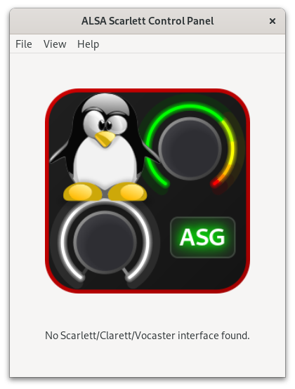

# ALSA Scarlett Control Panel Usage

Refer to [INSTALL.md](INSTALL.md) for prerequisites, how to build,
install, and run.

## No Interface Connected

If no interface is detected (usually because there isn’t one
connected!) you’ll see this window:

Plug in an interface or select the menu option File → Interface
Simulation and load a demo file to make more interesting things
happen.

## First Time Usage

If your interface is fresh out of the box (or you haven’t updated it
using the manufacturer’s software), you may need to update the
firmware and/or disable MSD Mode first.

### Firmware Update Required

Some interfaces require a firmware update before all their
functionality is available. If the firmware is not available on your
system, you’ll see this window:

In this case, click on the link, download and install the firmware
package, then restart `alsa-scarlett-gui`.

If a firmware update is required and the firmware is available, you’ll
see this window:

Click “Update”, then “Yes” to update the firmware.

For 4th Gen large interfaces (16i16, 18i16, 18i20), the firmware
update is a multi-step process (leapfrog, ESP, then application
firmware). The interface will reboot mid-upgrade and resume
automatically when the interface reconnects. If something goes wrong,
just restart the process.

### MSD (Mass Storage Device/Quick Start/Easy Start) Mode

If MSD Mode is enabled (as it is from the factory) and a firmware
update is not available or required, then you’ll see this window:

Click the “Enabled” button to disable MSD Mode, then click “Reboot” to
restart the interface, and in a moment the main window will appear.

## Startup Controls

The View → Startup menu option opens a window to configure settings
that only take effect when the interface is powered on.

The options common to most interfaces are:

- **Reset Configuration**: this will reset the configuration to the
  factory defaults. This is particularly useful with the 4th Gen and
  Vocaster interfaces if you’ve made a mess of the configuration and
  want to start again.

- **Update Firmware**: if a firmware update is found in the
  `/usr/lib/firmware/scarlett2` directory, then an option to update
  the firmware will be available here.

## File Menu

The File menu contains options to load and save the configuration,
load a configuration in simulation mode, and to exit the application.

### Load/Save Configuration

The entire state of the interface can be loaded and saved using the
File → Load Configuration (Ctrl-O) and File → Save Configuration
(Ctrl-S) menu options.

Two formats are supported:

- **Native format** (`.conf`, default): Saves all settings including
  custom port names, port visibility, stereo linking, and DSP filter
  parameters. This captures the complete state managed by
  `alsa-scarlett-gui`.

- **alsactl format** (`.state`): Saves only kernel-level ALSA controls
  using `alsactl`. Useful for interface simulation (see below) and
  compatibility with standard ALSA tools.

The file chooser shows both formats, with native as the default. On
load, the format is determined by the file extension.

For quick access to commonly-used configurations, see
[Presets](presets.md).

### Interface Simulation Mode

The GUI can load a `.state` file saved from a real interface and
display a GUI as if the corresponding interface was connected. Use
File → Interface Simulation (Ctrl-I) or specify the filename on the
command line.

This is useful if you don’t have an interface connected and want to
try, develop, or debug the GUI. The `demo` directory in the
distribution contains a sample file for every supported model.

## Keyboard Shortcuts

| Shortcut | Action                 |
|----------|------------------------|
| Ctrl-O   | Load Configuration     |
| Ctrl-S   | Save Configuration     |
| Ctrl-I   | Interface Simulation   |
| Ctrl-Q   | Exit                   |
| Ctrl-R   | Routing Window         |
| Ctrl-M   | Mixer Window           |
| Ctrl-L   | Levels Window          |
| Ctrl-D   | DSP Window             |
| Ctrl-G   | Configuration Window   |
| Ctrl-T   | Startup Window         |
| Ctrl-H   | Supported Hardware     |
| Ctrl-/   | About                  |

Shortcuts work from any window — subwindows forward unhandled hotkeys
to the main window.

## Interface Controls

The controls and menu items which are available vary widely, depending
on your specific interface.

There are six broad categories of interfaces with different
capabilities; each category of interface is described in a separate
document:

- [Scarlett 1st Gen 6i6+](iface-1st-gen.md)

  Full routing and mixing capabilities, but some significant caveats.

- [Scarlett 3rd Gen Solo and 2i2](iface-small.md)

  Minimal number of controls, and they are mostly accessible through
  hardware buttons anyway. Not very interesting.

- [Scarlett 2nd Gen 6i6+, 3rd Gen 4i4+, Clarett USB, and
  Clarett+](iface-large.md)

  Full routing and mixing capabilities.

- [Scarlett Small 4th Gen](iface-4th-gen-small.md)

  Full routing and mixing capabilities, remote-controlled input gain,
  but no software-controlled output controls.

- [Scarlett Big 4th Gen](iface-4th-gen-big.md)

  Full routing and mixing capabilities, remote-controlled input gain,
  software-controlled output volume controls, and monitor groups.

- [Vocaster One and Two](iface-vocaster.md)

  DSP processing (compressor, EQ, filters), routing, and mixing. See
  also the [DSP window documentation](dsp.md).

## Additional Documentation

- [Configuration Window](configuration.md) — Custom port
  names, I/O visibility, stereo linking, autogain settings,
  and monitor groups
- [Presets](presets.md) — Quick save and load of device
  configurations
- [DSP Window](dsp.md) — Compressor, EQ, and filter controls
  (Vocaster only)
- [Digital I/O Availability](digital-io-availability.md) —
  How sample rate and mode affect port availability

## Known Bugs/Issues

- The scarlett2 kernel driver does not report levels correctly when
  using dual and quad band sample rates (88.2kHz, 176.4kHz, 96kHz,
  192kHz).
