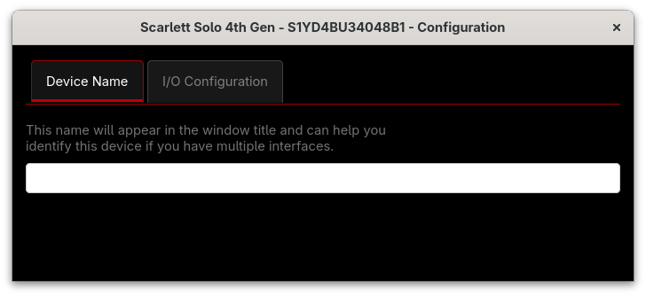
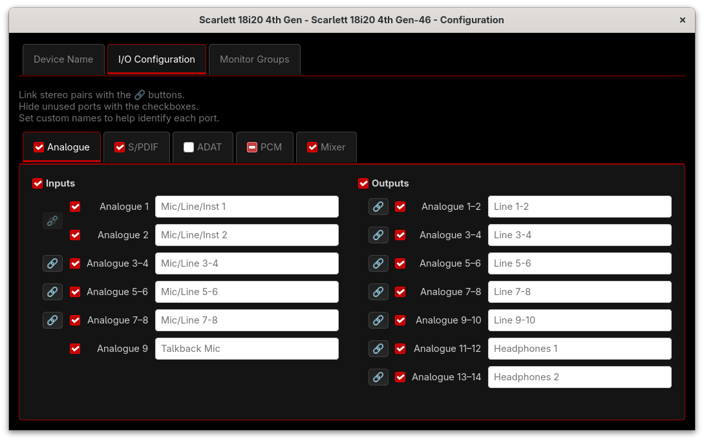
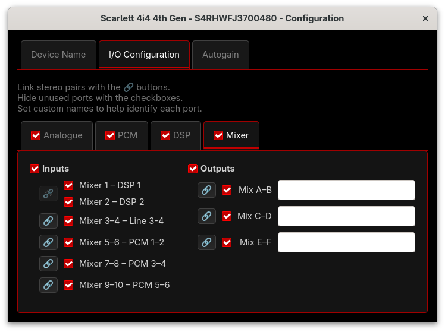
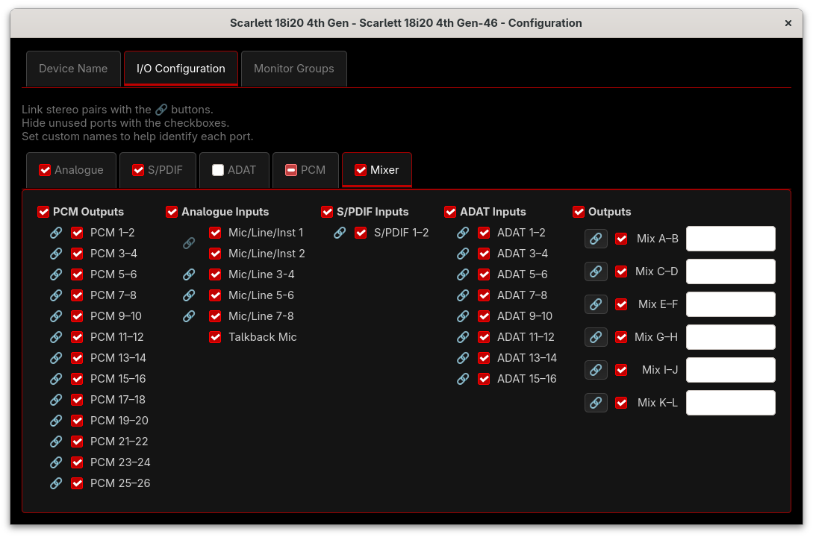
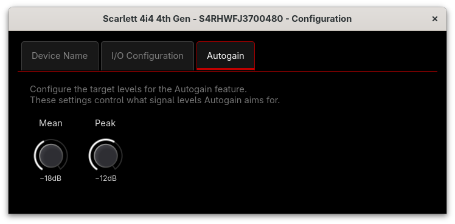
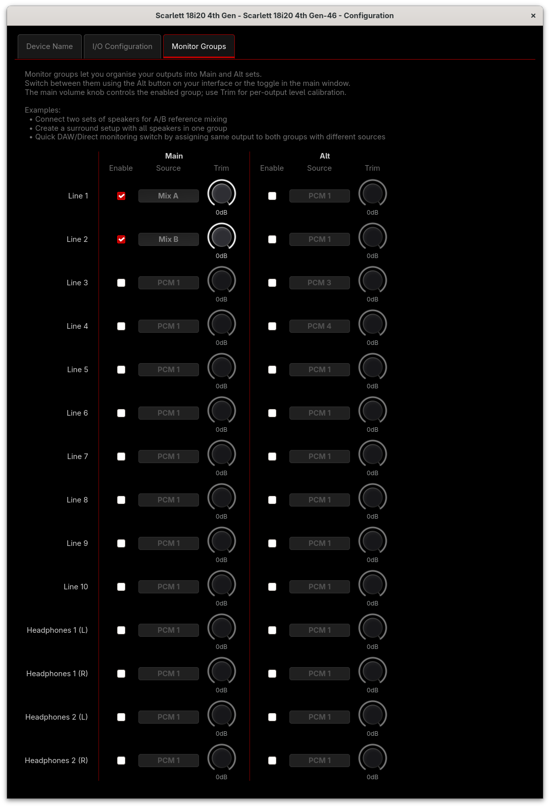

# Configuration Window

The Configuration window provides settings that customise how
the interface appears and behaves in alsa-scarlett-gui. Open it
with View → Configuration or press Ctrl-G.

The available tabs depend on your interface's capabilities:

| Tab | Interfaces |
|-----|------------|
| Device Name | All supported interfaces |
| Device Settings | Clarett USB/+ |
| I/O Configuration | All with routing/mixing (not Gen 3 Solo/2i2) |
| Autogain | Gen 4 2i2/4i4, Vocaster |
| Monitor Groups | Gen 4 16i16/18i16/18i20 |

Your last-viewed tab is remembered between sessions.

## Device Name

Set a custom name for your interface. This is particularly
useful when you have multiple interfaces of the same model —
without custom names, their windows would be labelled
identically, making them hard to tell apart.

The name appears in the window title bar alongside the model
and serial number.

## Device Settings

The Device Settings tab appears on Clarett interfaces and
provides hardware configuration options.

### S/PDIF Source

Select the S/PDIF input source:

- **None** — Disable S/PDIF input
- **Optical** — Use the optical input for S/PDIF
- **RCA** — Use the coaxial (RCA) input for S/PDIF

Changing this setting updates the available S/PDIF ports
throughout the application.

## I/O Configuration

The I/O Configuration tab lets you customise the names,
visibility, and stereo linking of inputs and outputs.

A help line at the top summarises what the checkboxes and name
fields do.

### Port Type Sub-Tabs

Use the sub-tabs to switch between different I/O categories.
The available sub-tabs depend on your interface:

- **Analogue** — Analogue inputs and outputs
- **S/PDIF** — S/PDIF digital inputs and outputs
- **ADAT** — ADAT digital inputs and outputs
- **PCM** — Computer audio (USB) inputs and outputs
- **DSP** — DSP inputs and outputs (Vocaster, Gen 4 small)
- **Mixer** — Mixer inputs and outputs

Each sub-tab has a checkbox in its label. This checkbox
shows/hides all ports of that type at once — it shows a mixed
state indicator when some ports are shown and others hidden.
Clicking a mixed-state checkbox hides all ports; clicking again
shows all.

### Visibility

Each port row has a checkbox to show or hide it. Within each
sub-tab, Inputs and Outputs columns each have their own "all"
checkbox at the top, which also supports mixed state.

Hidden ports:

- Are not displayed in the routing window
- Are not displayed in the mixer window
- Are not displayed in the level meters

Hiding a port only affects what is displayed — the actual
routing connections and mixer gain settings are preserved.
However, you cannot change the routing or gains for hidden
ports since the controls are not visible.

When a visible port is connected to a hidden port, the routing
window shows a short line with an arrow at the visible port to
indicate the connection exists but the other end is not shown.

### Stereo Linking

Click the link button between adjacent ports to pair them as a
stereo pair. When linked:

- The two individual rows collapse into a single pair row
  (e.g., "Analogue 1–2")
- A single name field applies to the pair
- The pair displays as a single stereo connection in the
  routing window
- Mixer controls for the pair are ganged

Click the link button again to unlink, which restores the
individual channel rows with their separate name fields.

### Custom Names

Type a name in the text field to give a port a custom name.
This name appears throughout the application — in the routing
window, mixer, and level meters — instead of the default port
name.

Leave the field empty to use the default name, which is shown
as placeholder text. The placeholder shows device-specific
names where available (e.g., "Mic 1", "Line 3") or generic
names otherwise.

### Mixer Sub-Tab

The Mixer sub-tab configures mixer inputs and outputs. The
layout varies by interface:

**Interfaces with routable mixer inputs** (Gen 1, Gen 2/3,
Gen 4 small, Clarett) show inputs with their routed source:

Each mixer input row shows "Mixer X — Source Name", updating
in real time as routing changes. Stereo linking of mixer inputs
follows the source — link the source ports and the mixer inputs
will be linked. When a linked source pair is connected, the
label shows the pair name (e.g., "Mixer 1–2 — Analogue 1–2").

**Interfaces with fixed mixer inputs** (Gen 4 large) show
inputs grouped into columns by source type:

Columns are labelled by source category (PCM Outputs, Analogue
Inputs, S/PDIF Inputs, ADAT Inputs) with a separate Outputs
column for mixer outputs. Each column has its own visibility
checkbox.

## Autogain

The Autogain tab configures the target levels for the automatic
gain feature.

The available controls depend on your interface:

- **Mean** and **Peak** (Gen 4 2i2/4i4): Target average and
  peak levels
- **Hot** (Vocaster): Single target level

These settings control what signal levels Autogain aims for
when activated from the main window.

## Monitor Groups

The Monitor Groups tab is available on the larger 4th Gen
interfaces (16i16, 18i16, 18i20) and lets you organise your
outputs into Main and Alt sets.

Switch between groups using the Alt button on your interface or
the toggle in the main window. The main volume knob controls
the currently enabled group.

### Controls

For each analogue output (or stereo pair when linked):

- **Enable** — Include this output in the Main or Alt group
- **Source** — Choose the audio source for each output in the
  group
- **Trim** — Per-output level calibration (useful for matching
  speaker levels)

When outputs are stereo-linked (via the I/O Configuration
tab), the monitor groups display automatically updates:

- The output shows as a single row with the pair name
- Trim uses a stereo fader that adjusts both channels together
- Enable and Source apply to both channels of the pair

### Example Use Cases

- **A/B Reference Mixing** — Connect two sets of speakers and
  assign them to Main and Alt groups to quickly switch between
  them for comparison

- **Surround Setup** — Put all your surround speakers in the
  Main group (leave Alt empty) for unified volume control from
  the main knob

- **DAW/Direct Monitoring Switch** — Assign the same outputs
  to both groups with different sources (e.g., Main from DAW
  playback, Alt from direct input monitoring) to quickly switch
  monitoring modes

- **Stereo/Mono Comparison** — Set Main to stereo mixer
  outputs and Alt to a mono mixdown to check mix compatibility

- **Mix Comparison** — Quickly switch between two different
  mixer settings
