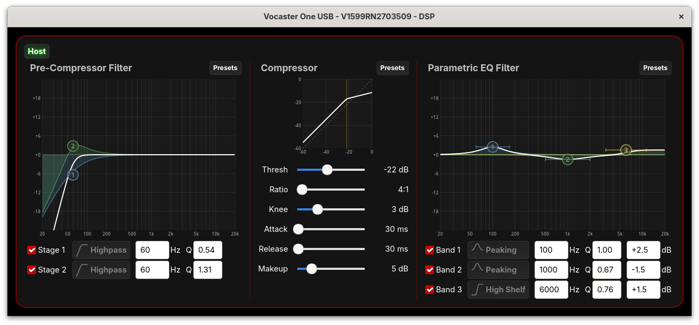
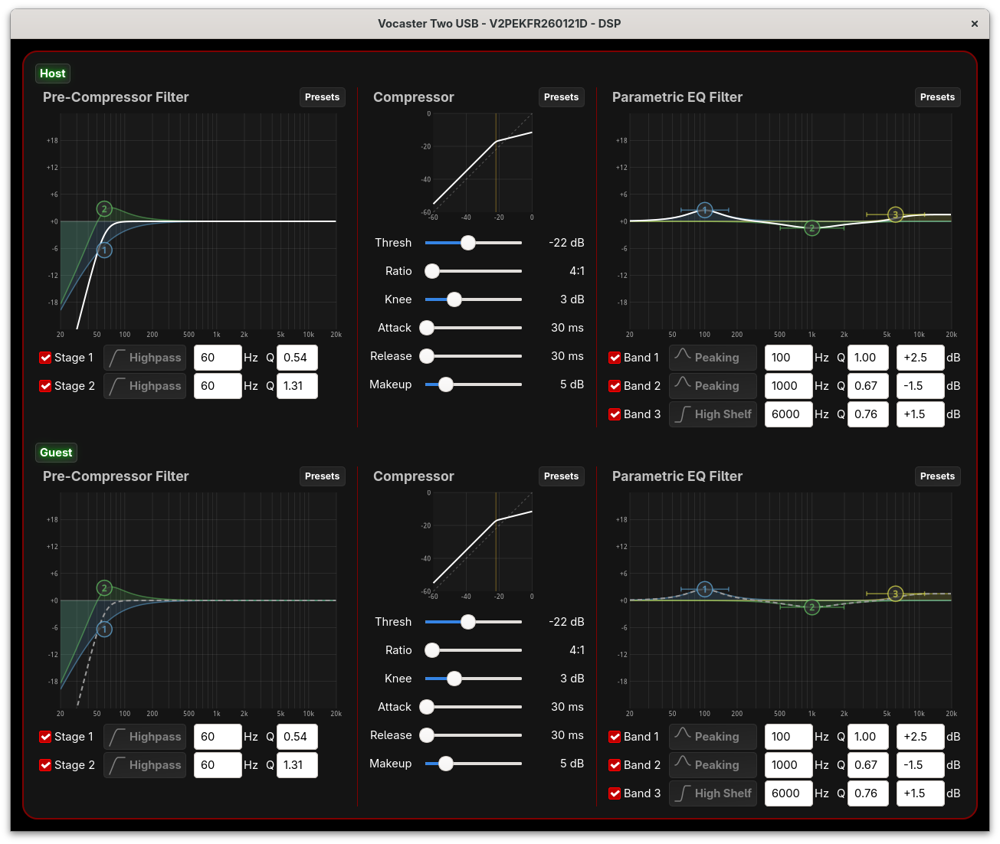
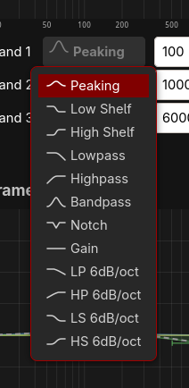

# DSP Window

The DSP window provides control over the digital signal
processing available on Vocaster interfaces. Each DSP channel
includes a pre-compressor filter, compressor, and parametric
EQ.

Open the DSP window with View → DSP or press Ctrl-D.

The Vocaster One has a single DSP channel ("Host"), while the
Vocaster Two has two channels ("Host" and "Guest"). These are
the default names; they can be customised in the
[Configuration window](configuration.md).

Each channel has three processing sections that are applied in
order:

1. **Pre-Compressor Filter** — Filtering before the compressor
2. **Compressor** — Dynamic range compression
3. **Parametric EQ Filter** — Tone shaping after the
   compressor

The channel name button (e.g., "Host") at the top left enables
or disables all DSP processing for that channel. When disabled,
the visualisations are dimmed and the combined response line
becomes grey and dashed.

## Pre-Compressor Filter

The pre-compressor filter provides two cascaded filter stages.
These are typically used as high-pass filters to remove
low-frequency rumble before the compressor, preventing unwanted
bass frequencies from triggering compression. However, all
filter types are available.

### Controls

- **Stage 1/2 Enable** — Checkbox to enable each filter stage
- **Filter Type** — Select the filter type (defaults to
  Highpass)
- **Frequency** — Centre/cutoff frequency in Hz (20–20000)
- **Q** — Filter Q/bandwidth (0.1–10.0), shown only for
  second-order filter types

### Frequency Response Graph

The graph shows the combined frequency response of both stages.
Each stage is shown as a coloured curve with shading, and
numbered handles indicate the filter positions.

You can adjust filters by:

- **Dragging** a numbered handle to adjust frequency and gain
  (or frequency and Q for filter types without gain)
- **Mouse wheel** over a handle to adjust Q (only for filter
  types that have gain)
- **Typing** values directly in the entry boxes

### Presets

Click the "Presets" button to select from:

- **None** — Bypass (flat response)
- **Rumble Reduction Low** — Gentle low-cut
- **Rumble Reduction High** — More aggressive low-cut

## Compressor

The compressor reduces the dynamic range of the signal, making
quiet sounds louder and loud sounds quieter relative to each
other.

### Transfer Curve

The compressor section displays a transfer curve showing input
level (horizontal) vs output level (vertical). The curve
visualises how the compressor will affect signals at different
levels:

- The diagonal dashed line shows unity (no compression)
- The solid curve shows the transfer function
- A dot on the curve shows the current input/output level in
  real-time, turning red when the signal reaches 0 dB

### Controls

- **Thresh** (Threshold) — Level above which compression
  begins (dB)
- **Ratio** — Amount of compression (e.g., 4:1 means 4 dB of
  input above threshold produces 1 dB of output)
- **Knee** — Width of the soft knee transition region (dB)
- **Attack** — How quickly compression engages (ms)
- **Release** — How quickly compression releases (ms)
- **Makeup** — Gain added after compression to restore
  level (dB)

The transfer curve updates in real-time as you adjust the
Threshold, Ratio, Knee, and Makeup controls.

### Presets

Click the "Presets" button to select from:

- **Off** — No compression
- **Low** — Light compression
- **Med** — Medium compression
- **High** — Heavy compression

## Parametric EQ Filter

The parametric EQ provides three bands of fully adjustable
equalisation for tone shaping.

### Controls

Each band has:

- **Band Enable** — Checkbox to enable the band
- **Filter Type** — Select from various filter types (defaults
  to Peaking)
- **Frequency** — Centre/cutoff frequency in Hz (20–20000)
- **Q** — Filter Q/bandwidth (0.1–10.0), shown only for
  second-order filter types
- **Gain** — Boost or cut in dB (-18 to +18), shown only for
  filter types that use gain

### Frequency Response Graph

The graph shows the combined frequency response of all three
bands:

- Individual band curves are shown with coloured shading
- The white line shows the combined response
- Numbered handles (1, 2, 3) indicate each band's position

### Interactive Graph Editing

The EQ graph supports direct manipulation:

- **Click and drag** a numbered handle to adjust frequency and
  gain, or frequency and Q for filter types without gain
- **Mouse wheel** over a handle to adjust Q (only for filter
  types that have gain)
- **Hover** over a handle or band controls to highlight both
  the handle and the corresponding controls

### Filter Types

Available filter types (applies to both the pre-compressor
filter and parametric EQ):

| Type | Description | Has Gain | Has Q |
|------|-------------|----------|-------|
| Peaking | Bell-shaped boost/cut at the centre frequency | Yes | Yes |
| Low Shelf | Boost/cut below the corner frequency | Yes | Yes |
| High Shelf | Boost/cut above the corner frequency | Yes | Yes |
| Lowpass | Remove frequencies above the cutoff (12 dB/oct) | No | Yes |
| Highpass | Remove frequencies below the cutoff (12 dB/oct) | No | Yes |
| Bandpass | Pass only frequencies near the centre | No | Yes |
| Notch | Remove a narrow band of frequencies | No | Yes |
| Gain | Simple level adjustment (no frequency shaping) | Yes | No |
| LP 6dB/oct | Gentle lowpass (first-order) | No | No |
| HP 6dB/oct | Gentle highpass (first-order) | No | No |
| LS 6dB/oct | Gentle low shelf (first-order) | Yes | No |
| HS 6dB/oct | Gentle high shelf (first-order) | Yes | No |

The dropdown shows icons representing each filter's frequency
response shape.

"Has Gain" determines whether the Gain control is shown and
whether vertical dragging adjusts gain (if yes) or Q (if no).
"Has Q" determines whether the Q control is shown and whether
mouse wheel adjustment is available.

### Presets

Click the "Presets" button to select from:

- **Radio** — Bright, present sound
- **Clean** — Neutral, balanced tone
- **Warm** — Enhanced low-mid warmth
- **Bright** — Enhanced high frequencies

## Saving DSP Settings

DSP settings are stored in the hardware and persist across
application and device restarts. The filter parameters
(type, frequency, Q, gain, and enable state) are also saved
locally, so disabled filters retain their settings for
re-enabling later. Settings can be saved and loaded as part
of the interface configuration using File → Save/Load
Configuration or [Presets](presets.md).
