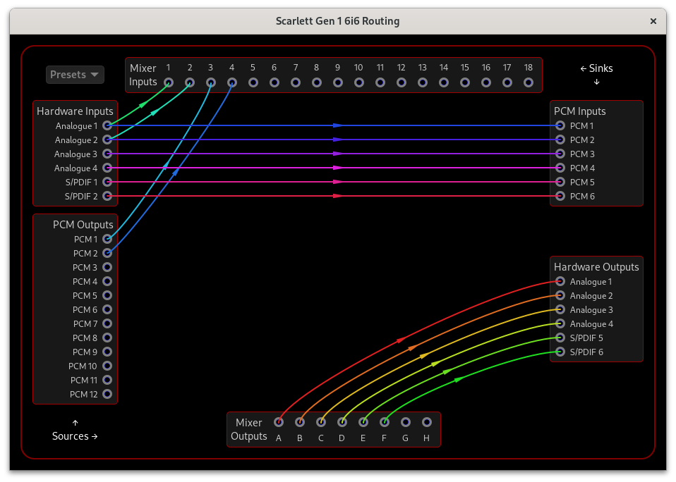

# ALSA Scarlett Control Panel

## Scarlett 1st Gen Interfaces

This document describes how to use the ALSA Scarlett Control Panel
with the Scarlett 1st Gen interfaces:

- Scarlett 1st Gen 6i6, 8i6, 18i6, 18i8, 18i20

Note: The 1st Gen Scarlett Solo, 2i2, and 2i4 have all their controls
accessible from the front panel of the device, and there are no
proprietary software controls, so they do not require this control
panel software.

## Important Driver Limitations

The 1st Gen Scarlett devices have some important limitations in the
ALSA driver implementation that you should be aware of:

1. **Initial State Detection**: The driver cannot read the current
   state of hardware controls (this appears to be a limitation of the
   device firmware). When alsa-scarlett-gui starts, what you see will
   not reflect the actual state of your device unless the controls
   have previously been set since startup.

2. **State Update Issues**: The driver only updates the hardware state
   when it thinks a setting needs to be changed. If the driver
   incorrectly believes a control is already in the desired state, it
   won’t actually update the control.

3. **Level Meters**: The driver does not support reading the level
   meters from the hardware.

4. **Startup Configuration**: The driver is not able to save the
   current configuration to the non-volatile memory of the device, so
   you’ll need to reapply the desired configuration each time you
   restart it (or write your preferred configuration using MixControl
   on Windows or Mac).

### Recommended Workaround

To ensure your settings are properly applied:

1. Apply a “zero” configuration that sets all controls to values that
   are *not* what you desire.
2. Then apply your desired configuration

This two-step process helps ensure that the driver actually sends all
commands to the hardware. You may want to create a script using
`alsactl` for this purpose.

## Main Window

The main window is divided into three sections:

- Global Controls
- Analogue Input Controls
- Analogue Output Controls

The particular controls available depend on the interface model.

Note that the View menu option lets you open two other windows which
contain additional controls, described in the following sections:
- [Routing](#routing)
- [Mixer](#mixer)

The Levels and Startup windows that are available for later-generation
interfaces are not available for 1st Gen interfaces due to driver limitations.

### Global Controls

Global controls relate to the operation of the interface as a whole.

#### Clock Source

Clock Source selects where the interface receives its digital clock
from. If you aren’t using S/PDIF or ADAT inputs, set this to Internal.

#### Sync Status

Sync Status indicates if the interface is locked to a valid digital
clock. If you aren’t using S/PDIF or ADAT inputs and the status is
Unlocked, change the Clock Source to Internal.

### Analogue Input Controls

#### Inst

The Inst buttons are used to select between Mic/Line and Instrument
level/impedance. When plugging in microphones or line-level equipment
(such as a synthesizer, external preamp, or effects processor) to the
input, set it to “Line”. The “Inst” setting is for instruments with
pickups such as guitars.

#### Pad

Enabling Pad engages a 10dB attenuator in the channel, giving you more
headroom for very hot signals.

#### Gain

The Gain switch selects Low or High gain for the input channel.

### Analogue Output Controls

The analogue output controls let you set the output volume (gain) on
the analogue line outputs.

Click and drag up/down on the volume dial to change the volume, use
your arrow keys, Home/End/PgUp/PgDn keys, or use your mouse scroll
wheel to adjust. You can also double-click on it to quickly toggle the
volume between off and 0dB.

## Routing

The routing window allows complete control of signal routing between
the hardware inputs/outputs, internal mixer, and PCM (USB)
inputs/outputs.

To manage the routing connections:

- Click and drag from a source to a sink or a sink to a source to
  connect them. Audio from the source will then be sent to that sink.

- Click on a source or a sink to clear the links connected to that
  source/sink.

Note that a sink can only be connected to one source, but one source
can be connected to many sinks. If you want a sink to receive input
from more than one source, use the mixer inputs and outputs:

- Connect the sources that you want to mix together to mixer inputs
- Connect mixer outputs to the sinks that you want to receive the
  mixed audio
- Use the Mixer window to set the amount of each mixer input that is
  sent to each mixer output

The Presets menu can be used to clear all connections, or to set up
common configurations:

- The “Direct” preset sets up the usual configuration using the
  interface as a regular audio interface by connecting:

  - all Hardware Inputs to PCM Inputs
  - all PCM Outputs to Hardware Outputs

- The “Preamp” preset connects all Hardware Inputs to Hardware
  Outputs.

- The “Stereo Out” preset connects PCM 1 and 2 Outputs to pairs of
  Hardware Outputs.

## Mixer

If you use the Routing window to connect Sources to Mixer Inputs and
Mixer Outputs to Sinks, then you can use the Mixer window to set the
amount of each Mixer Input that is sent to each Mixer Output using a
matrix of controls.

Click and drag up/down on the gain controls to adjust, or use your
mouse scroll wheel. You can also double-click on the control to
quickly toggle between off and 0dB.
