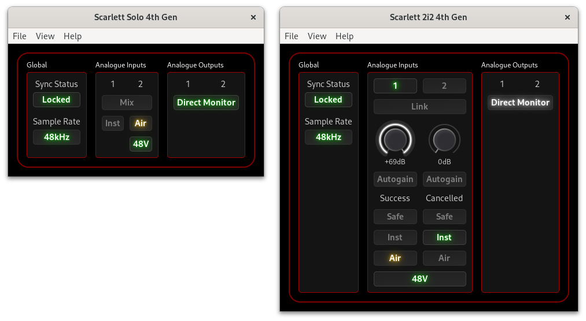
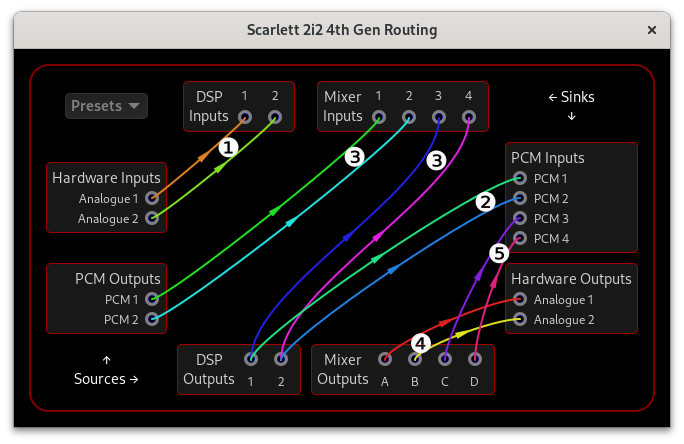
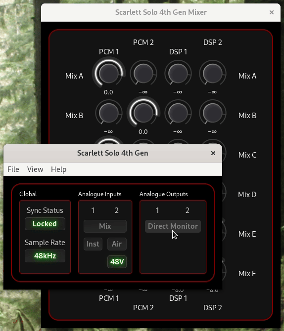
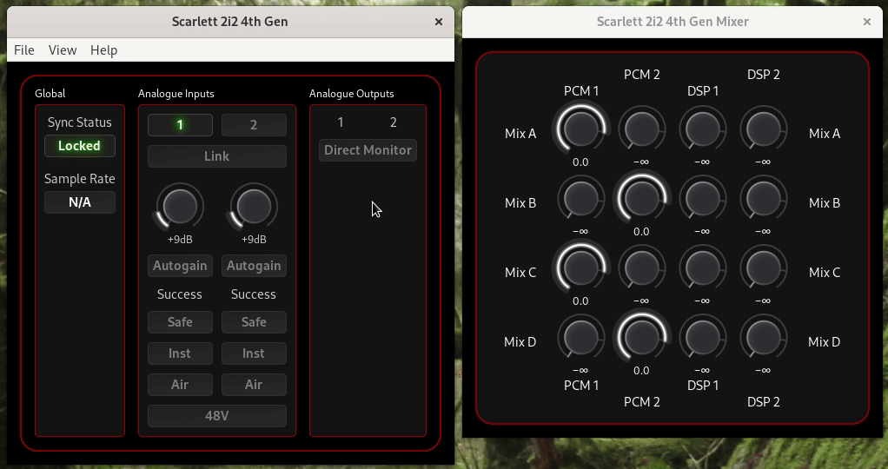
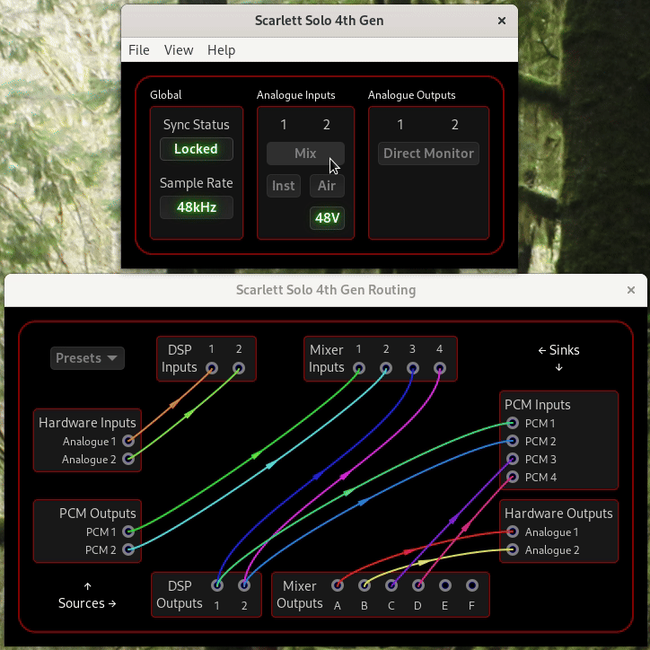
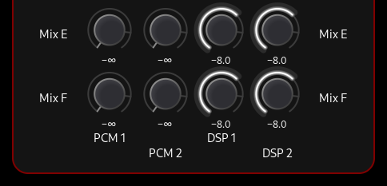
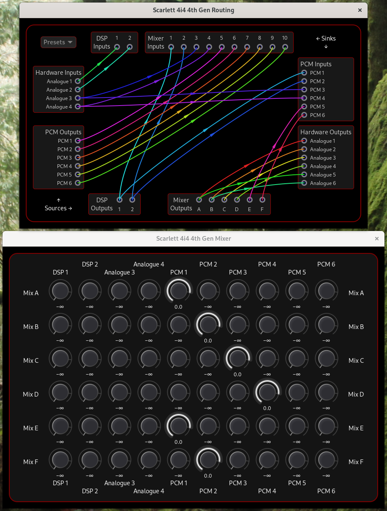
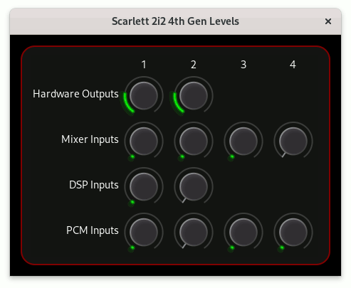

# ALSA Scarlett2 Control Panel

## Scarlett 4th Gen Interfaces

This document describes how to use the ALSA Scarlett2 Control Panel
with the Scarlett 4th Gen interfaces:

- Scarlett 4th Gen Solo, 2i2, and 4i4

### Comparison with earlier Scarlett and Clarett Interfaces

If you are familiar with the Scarlett 2nd and 3rd Gen interfaces or
the Clarett interfaces, the major differences to the 4th Gen
interfaces from the point of view of this software are:

- The 4th Gen Solo and 2i2 interfaces have the full routing and mixing
  capabilities of the larger 2nd and 3rd Gen and Clarett interfaces
  (although the line outputs and the headphone outputs are still
  linked).

- The 4th Gen 2i2 and 4i4 interfaces have software-controllable
  (“remote”) input gain controls.

- The 4th Gen interfaces don’t have the output volume and mute
  controls that the 2nd and 3rd Gen and Clarett interfaces have.

- The Air mode with Presence+Drive is implemented with a DSP which is
  separately routable.

## Main Window

The main window is divided into three sections:
- Global Controls
- Analogue Input Controls
- Analogue Output Controls

The main window for the Solo and 2i2 interfaces is shown below; the
4i4 interface is similar to the 2i2, but doesn’t have the Direct
Monitor control, and can show the position of the front panel volume
knobs.

### Global Controls

#### Sync Status

Sync Status indicates if the interface is locked to a valid digital
clock. This should only ever briefly show “Unlocked” when the sample
rate is changed as these interfaces can only use their internal clock.

#### Power

The 4i4 has a “Power” control that displays the power status. It can
be “Fail”, “Bus”, or “External”. “Fail” means that the interface is
not receiving sufficient power; please see the Scarlett 4i4 4th Gen
User Guide for more information. “Bus” vs. “External” indicates
whether the interface is receiving power from the second USB-C port
(“External”) or not (“Bus”).

#### Sample Rate

Sample Rate is informative only, and displays the current sample rate
if the interface is currently in use. In ALSA, the sample rate is set
by the application using the interface, which is usually a sound
server such as PulseAudio, JACK, or PipeWire.

### Analogue Input Controls

The analogue input controls available depend on the interface model:

- **Instrument, Air, and Phantom Power**: All models
- **Mix**: Solo only (described later in the [Solo Mix
  Control](#solo-mix-control) section)
- **Input Select, Link, Gain, Autogain, and Safe**: 2i2 and 4i4

#### Instrument

The Inst button(s) are used to select between Mic/Line and Instrument
level/impedance. When plugging in microphones or line-level equipment
(such as a synthesizer, external preamp, or effects processor) to the
input, set it to “Line”. The “Inst” setting is for instruments with
pickups such as guitars.

#### Air

The Scarlett 3rd Gen introduced Air mode which transformed your
recordings and inspired you while making music by boosting the
signal’s high-end. The 4th Gen interfaces now call that “Air Presence”
and add a new mode “Air Presence+Drive” which boosts mid-range
harmonics in your sound.

#### Phantom Power (48V)

Turning the “48V” switch on sends “Phantom Power” to the XLR
microphone input. This is required for some microphones (such as
condensor microphones), and damaging to some microphones (particularly
vintage ribbon microphones).

The 2i2 has a single 48V switch that controls both channels, and the
4i4 has an independent 48V switch for each channel.

#### Input Select

The 2i2 and 4i4 interfaces have hardware buttons for 48V, Inst, Air,
Auto, and Safe. The “Input Select” control allows you to choose which
channel those buttons control.

#### Link

The “Link” control links the 48V, Inst, Air, Auto, and Safe controls
together so that they control both channels simultaneously.

#### Gain

The “Gain” controls adjust the input gain for the selected channel.
Click and drag up/down on the control to adjust the gain, use your
mouse scroll wheel, or click the control to select it and use the
arrow keys, Page Up, Page Down, Home, and End keys.

#### Autogain

When the “Autogain” control is enabled, the interface will listen to
the input signal for ten seconds and automatically adjust the gain to
get the best signal level. When autogain is not running, the
most-recent autogain exit status is shown below the “Autogain”
control.

#### Safe

“Safe” mode is a feature that automatically reduces the gain if the
signal is too loud. This can be useful to prevent clipping.

### Analogue Output Controls

The analogue output controls available depend on the interface model:

- **Direct Monitor**: Solo and 2i2
- **Volume Knobs**: 4i4

#### Direct Monitor

Enabling Direct Monitor sends the analogue input signals to the
analogue outputs (speakers/headphones) for zero-latency monitoring.

On the 2i2, you have the choice of Mono or Stereo monitoring when you
click the button:

- **Mono** sends both inputs to the left and right outputs
- **Stereo** sends input 1 to the left, and input 2 to the right
  output.

As the 4th Gen Solo and 2i2 interfaces have the full routing and
mixing capabilities of the larger 2nd and 3rd Gen interfaces, the
Direct Monitor levels can be [adjusted in the
mixer](#solo-direct-monitor).

The 4i4 has no Direct Monitor button, but that functionality can be
achieved with [appropriate configuration in the routing and mixing
windows](#4i4-sample-direct-monitor-configuration).

#### Volume Knobs

The 4i4 interface has volume knobs on the front panel, the position of
which is shown in the main window.

## Routing and Mixing

The routing and mixing capabilities of the 4th Gen interfaces are the
same in concept as the 2nd and 3rd Gen interfaces, but there is a DSP
which is separately routable, and the default routing uses the mixer
extensively.

From the main window, open the Routing window with the View → Routing
menu option or pressing Ctrl-R:

To understand the signal flow, note the following:
1. The Analogue 1 & 2 Inputs (i.e. the Mic/Line/Inst inputs) are
   routed to the DSP Inputs.
2. The DSP Outputs are routed to the PCM 1 & 2 Inputs (that’s what
   ALSA sees as the first two inputs from the interface for
   recording).
3. The PCM Outputs (that’s what ALSA sees as the interface outputs for
   playback) and the DSP Outputs are all connected to the Mixer
   Inputs.
4. The Mixer A & B Outputs are connected to the Hardware Analogue
   outputs (i.e. your speakers/headphones) so you can hear any mix of
   the PCM and DSP Outputs (this is how the Direct Monitor function
   works).
5. The Mixer C & D Outputs are connected to the PCM 3 & 4 Inputs (this
   is referred to as Loopback, for recording audio from your computer,
   but can be used for another purpose if you want).

Important Notes:
- The “Presets” are generally not useful with the 4th Gen interfaces
  as they are designed for the 2nd and 3rd Gen interfaces. If you try
  these out, you’ll probably want to reset back to the factory
  defaults afterwards.
- Besides Air Mode, the DSP is also used for the gain halo level
  meters and autogain, so if you route something else to the DSP
  Inputs, those features will work “rather differently”.
- The Focusrite Control 2 software can’t control most of this routing,
  so if you make changes here and then want to use Focusrite Control
  2, you’ll probably need to reset the routing back to the factory
  default settings. There’s currently no way to reset to factory
  default settings from the Focusrite Control 2 software; you’ll need
  to use the [Reset Configuration](USAGE.md#startup-controls) option
  in this software, or the `scarlett2` utility.

To adjust the routing:

- Click and drag from a source to a sink or a sink to a source to
  connect them. Audio from the source will then be sent to that sink.

- Click on a source or a sink to clear the links connected to that
  source/sink.

Note that a sink can only be connected to one source, but one source
can be connected to many sinks.

To adjust the mixer output levels:

1) Open the mixer window with the main window View → Mixer menu
   option, or press Ctrl-M.

2) Mixer levels can be adjusted with your keyboard or mouse in the
   same way as the [Gain Controls](#gain).

### Solo Direct Monitor

When you enable or disable Direct Monitor on the Solo interface, the
interface will update the Mix A and B Outputs so that the DSP 1 & 2
Outputs are mixed in (or not) with the PCM 1 & 2 Outputs. Note how the
volume of the PCM outputs is also reduced when Direct Monitor is
enabled so that you can hear the DSP outputs (i.e. your Analogue
inputs) more clearly.

If you customise the Mix A/B mixer levels while Direct Monitor is
enabled, the new settings will be saved and used when Direct Monitor
is enabled again.

### 2i2 Direct Monitor

Similarly to the Solo interface, the 2i2 interface will update the Mix
A and B Outputs when you enable or disable Direct Monitor, but the 2i2
has Mono and Stereo options:

Note how in Mono mode:

- the DSP 1 & 2 Outputs are mixed to both the left and right outputs

and in Stereo mode:

- DSP 1 (i.e. Analogue Input 1) is sent to the left output (Mix A),
  and
- DSP 2 (i.e. Analogue Input 2) is sent to the right output (Mix B).

### Solo Mix Control

The Mix control is only available on the Solo interface. It switches
the source for the PCM 1 & 2 Inputs between the DSP Outputs and the
Mixer E & F Outputs.

By default, enabling this control will mix the Analogue 1 & 2 Inputs
together before they are sent to the PCM 1 & 2 Inputs:

This can be useful if you want to treat the PCM 1 & 2 Inputs as a
stereo pair, and not have the line/instrument input panned hard left
and the microphone input panned hard right.

The mixer levels for the Mix E & F Outputs can adjusted to suit.

### 4i4 Routing and Mixing

Although the 4th Gen 4i4 has no explicit Direct Monitor control, it is
far more flexible because it has 6 PCM inputs, 6 PCM outputs, a 10×6
mixer, and 6 Analogue Hardware outputs.

Analogue Outputs 1–4 correspond to the Line Outputs 1–4 on the back of
the interface, and Analogue Outputs 5–6 correspond to the Headphone
Output on the front of the interface.

The default routing and mix for the 4i4 is shown below:

Note that with the default routing/mix settings:
- The Analogue Inputs 1–4 are routed to the PCM Inputs 1–4 (the first
  two going via the DSP).
- PCM Inputs 5–6 are used for Loopback (recording audio from your
  computer).
- All the Hardware Inputs and PCM Outputs are connected to the Mixer
  Inputs.
- PCM Outputs 1–4 are connected to the Analogue Outputs 1–4 (via the
  mixer).
- The Line 1–2 Outputs (Analogue Outputs 1–2) and the Headphones
  (Analogue Outputs 5–6) share the Mixer Outputs A & B.

#### 4i4 Sample Direct Monitor Configuration

A common configuration for the 4i4 is to send the PCM 1 & 2 Outputs
mixed with the Analogue Inputs 1 & 2 to the Headphones, while leaving
the Analogue Outputs 1–2 as they are. This is an advanced version of
the direct monitoring feature that is available on the Solo and 2i2.
It can be implemented by:

1) Route Mixer Outputs E & F to Analogue Outputs 5 & 6.
2) Turn up Mix E & F DSP 1 & 2 levels in the mixer (see the mixer
   example above for [2i2 Direct Monitor](#2i2-direct-monitor)).

As there are only 6 Mixer Outputs, the PCM 5 & 6 Inputs (Loopback) are
now shared with the headphones. If you want to retain the Loopback
functionality without having the Analogue Inputs mixed in, you could:
- Route the PCM 1 & 2 Outputs directly to the PCM 5 & 6 Inputs, rather
  than going via the mixer, or
- Free up Mixer Outputs A & B for Loopback by routing PCM Outputs 1 &
  2 directly to Analogue Outputs 1 & 2.

Besides Direct Monitor, there are many other possibilities for
routing/mixing with the 4i4. For example, by using the additional PCM
Outputs and Inputs you could set up a mix-minus configuration for a
podcast/video call.

## Levels

The meters show the levels seen by the interface at every routing
sink: Hardware Outputs, Mixer Inputs, DSP Inputs, and PCM Inputs. Open
this window by selecting the View → Levels menu option or pressing
Ctrl-L.

Look at this in conjunction with the routing window to understand
which meter corresponds to which source or sink.

Thanks for reading this far! If you appreciate the hundreds of hours
of work that went into the kernel driver, the control panel, and this
documentation, please consider supporting the author with a
[donation](../README.md#donations).
