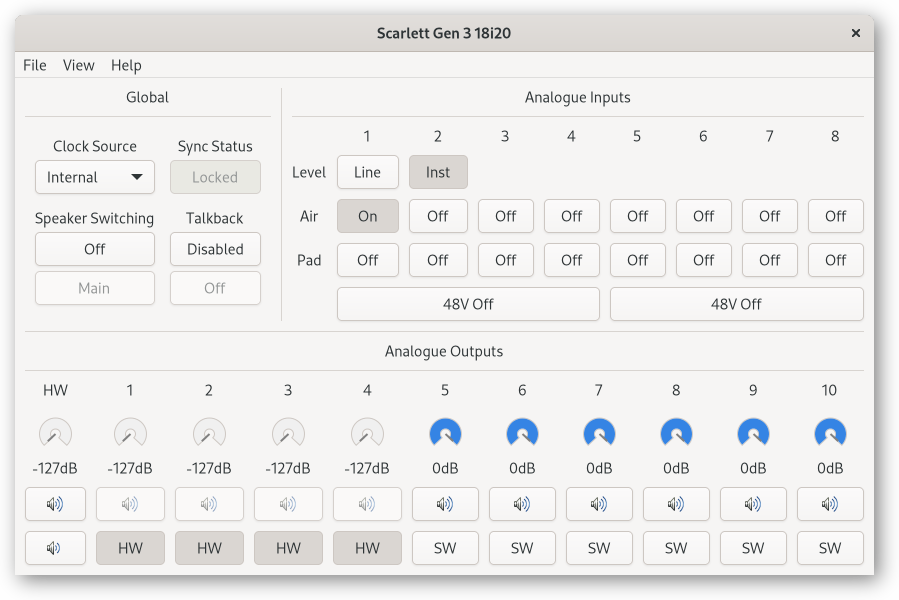
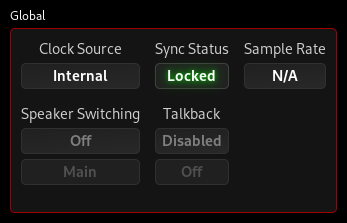
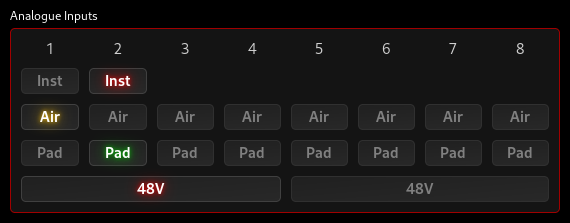
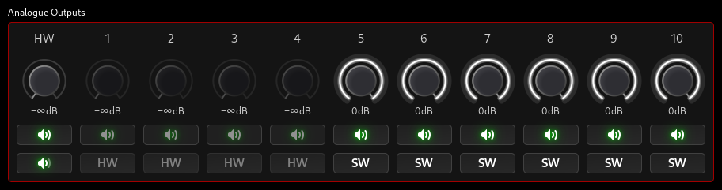
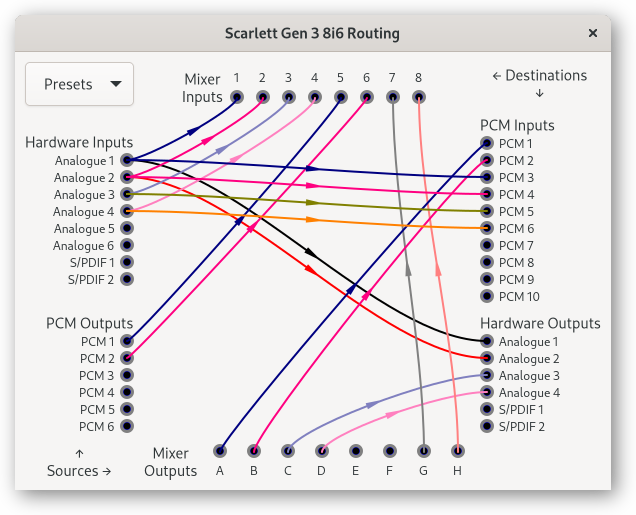
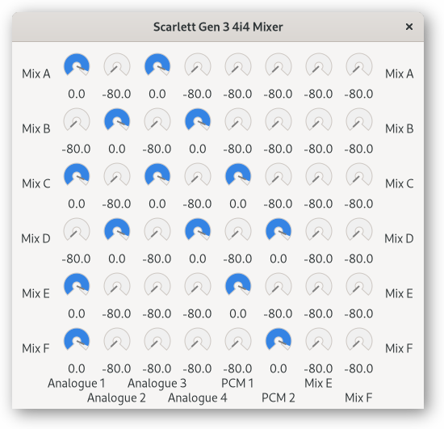
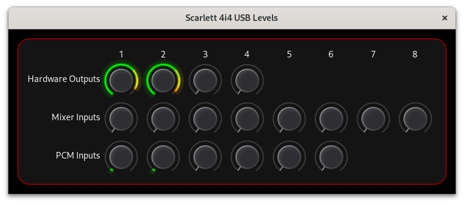
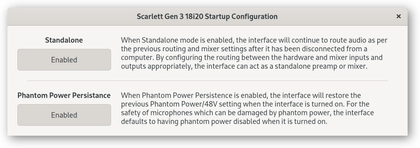

# ALSA Scarlett2 Control Panel

## Large Scarlett 2nd and 3rd Gen and Clarett Interfaces

This document describes how to use the ALSA Scarlett2 Control Panel
with the larger Scarlett 2nd Gen, 3rd Gen, and Clarett USB interfaces:

- Scarlett 2nd Gen 6i6, 18i8, 18i20
- Scarlett 3rd Gen 4i4, 8i6, 18i8, 18i20
- Clarett 2Pre, 4Pre, 8Pre USB
- Clarett+ 2Pre, 4Pre, 8Pre

## Main Window

The main window is divided into three sections:

- Global Controls
- Analogue Input Controls
- Analogue Output Controls

The particular controls available depend on the interface model; the
3rd Gen 18i20 has all the controls so is shown here:

Note that the View menu option lets you open three other windows which
contain additional controls, described in the following sections:
- [Routing](#routing)
- [Mixer](#mixer)
- [Levels](#levels)
- [Startup](#startup)

### Global Controls

Global controls relate to the operation of the interface as a whole.

#### Clock Source (interfaces with S/PDIF or ADAT inputs only)

Clock Source selects where the interface receives its digital clock
from. If you aren’t using S/PDIF or ADAT inputs, set this to Internal.

#### Sync Status

Sync Status indicates if the interface is locked to a valid digital
clock. If you aren’t using S/PDIF or ADAT inputs and the Sync Status
is Unlocked, change the Clock Source to Internal.

#### Sample Rate

Sample Rate is informative only, and displays the current sample rate
if the interface is currently in use. In ALSA, the sample rate is set
by the application using the interface, which is usually a sound
server such as PulseAudio, JACK, or PipeWire.

#### Speaker Switching (Scarlett 3rd Gen 18i8 and 18i20 only)

Speaker Switching lets you swap between two pairs of monitoring
speakers very easily.

When enabled (Main or Alt):

- Line Out 1–4 Volume Control Switches are locked to HW
- Line Out 3/4 routing is saved
- Line Out 3/4 routing is set to the Line Out 1/2 routing

When set to Main, Line outputs 3 and 4 are muted.

When set to Alt, Line outputs 1 and 2 are muted.

When disabled (Off):
- Global mute is activated ⭐
- Line Out 1–4 Volume Control Switches are unlocked
- Line Out 3/4 routing is restored to the saved values

⭐ You likely won’t expect this to happen. Make sure to unmute the
outputs after disabling speaker switching if you want to hear
something again.

#### Talkback (Scarlett 3rd Gen 18i20 only)

Talkback lets you add another channel (usually the talkback mic) to a
mix with a button push, usually to talk to musicians, and without
using an additional mic channel.

The Talkback feature has a few parts:

- Talkback Microphone connected to Analogue Input 9
- Talkback Disable/Enable and Off/On software switches
- Talkback Off/On physical switch
- Talkback Mix (one switch per mix)
- Mix Input 25

To set up the talkback feature, set Mix Input 25 to the talkback
source (usually Analogue Input 9), enable the Talkback Mix switches
for the mixes you want the talkback input to be heard on, and change
the Talkback control from Disabled to Off. Leave the Mix Input 25 gain
controls at zero (−127dB), otherwise the talkback inputs will be heard
even when talkback is disabled/off.

Pressing the Talkback switch on the device will then lower the volume
of the other inputs on the mixes for which talkback is enabled and
unmute Mix Input 25 on those mixes.

Talkback can also be activated by changing the Talkback control from
Off to On.

The talkback microphone can also be used just the same as any of the
other analogue inputs and routed to a physical output, PCM input, or
mixer input.

### Analogue Input Controls

This section is applicable to all interfaces except the Scarlett 2nd
Gen 18i20 which has hardware-only buttons for these features.

#### Inst

The Inst buttons are used to select between Mic/Line and Instrument
level/impedance. When plugging in microphones or line-level equipment
(such as a synthesizer, external preamp, or effects processor) to the
input, set it to “Line”. The “Inst” setting is for instruments with
pickups such as guitars.

#### Air (Scarlett 3rd Gen and Clarett only)

Enabling Air will transform your recordings and inspire you while
making music.

#### Pad

Enabling Pad engages a 10dB attenuator in the channel, giving you more
headroom for very hot signals.

#### Phantom Power (48V)

Scarlett 2nd Gen and Clarett devices have a hardware button for
controlling phantom power.

Scarlett 3rd Gen devices have hardware and software control of phantom
power. Turning the “48V” switch on sends “Phantom Power” to the XLR
microphone input. This is required for some microphones (such as
condensor microphones), and damaging to some microphones (particularly
vintage ribbon microphones).

On Scarlett 3rd Gen devices, phantom power is turned off by default
when the interface is turned on. This can be changed in the startup
configuration (menu option View → Startup).

### Analogue Output Controls

The analogue output controls let you set the output volume (gain) on
the analogue line out and headphone outputs. All interfaces support
setting the gain and muting individual channels.

Click and drag up/down on the volume dial to change the volume, use
your arrow keys, Home/End/PgUp/PgDn keys, or use your mouse scroll
wheel to adjust. You can also double-click on it to quickly toggle the
volume between off and 0dB.

The biggest interfaces: Scarlett 2nd Gen 18i20, 3rd Gen 18i8, and 3rd
Gen 18i20 have a switchable hardware/software volume control. The
position of the big volume knob on the front of the interface is
indicated by the “HW” dial in the GUI. The analogue outputs can have
their volume set either by the knob (“HW” setting of of the HW/SW
button) or by the dials on each output (“SW” setting of the HW/SW
button).

When set to HW, the mute/volume status for those channels is
controlled by the hardware volume knob and the global dim/mute
controls and the software volume dial and mute button for those
channels are disabled.

There are “mute” and “dim” (reduce volume) buttons below the “HW” dial
which affect only the outputs with “HW” control enabled. The 3rd Gen
18i8 doesn’t have physical buttons or indicator lights for these
controls, but the 18i20 devices do.

On the other (smaller) interfaces, the big volume knob on the front of
the interface controls the volume of the Line 1 and 2 outputs. This is
in addition to the software volume control, therefore both must be
turned up in order to hear anything. The other (line 3+) analogue
outputs are only controlled by the software controls.

The volume controls for the headphone outputs on each interface
operate in addition to any other hardware or software volume controls
for those channels. When using headphones, the volumes for those
channels would usually be set to 0dB and the actual volume controlled
with the physical headphone volume control(s).

## Routing

The routing window allows complete control of signal routing between
the hardware inputs/outputs, internal mixer, and PCM (USB)
inputs/outputs.

To manage the routing connections:

- Click and drag from a source to a sink or a sink to a source to
  connect them. Audio from the source will then be sent to that sink.

- Click on a source or a sink to clear the links connected to that
  source/sink.

Note that a sink can only be connected to one source, but one source
can be connected to many sinks. If you want a sink to receive input
from more than one source, use the mixer inputs and outputs:

- Connect the sources that you want to mix together to mixer inputs
- Connect mixer outputs to the sinks that you want to receive the
  mixed audio
- Use the Mixer window to set the amount of each mixer input that is
  sent to each mixer output

The Presets menu can be used to clear all connections, or to set up
common configurations:

- The “Direct” preset sets up the usual configuration using the
  interface as a regular audio interface by connecting:

  - all Hardware Inputs to PCM Inputs
  - all PCM Outputs to Hardware Outputs

- The “Preamp” preset connects all Hardware Inputs to Hardware
  Outputs.

- The “Stereo Out” preset connects PCM 1 and 2 Outputs to pairs of
  Hardware Outputs.

The Direct routing configuration is the simplest most-generally-useful
configuration:

### Loopback

Scarlett 2nd Gen, Clarett USB, and Clarett+ interfaces have as many
PCM Inputs as Hardware Inputs. Scarlett 3rd Gen interfaces have two
more PCM Inputs which Focusrite Control uses as “Loopback” inputs.

The “Loopback” feature advertised for Scarlett 3rd Gen devices is
actually a limitation of the proprietary Focusrite Control software.
All supported devices with a mixer (that’s all but the 2nd and 3rd Gen
Solo/2i2 interfaces) support full reassignment of the PCM Inputs, so
you can have any PCM Input as a “Loopback” or assigned to any other
source.

### Talkback

The Scarlett 3rd Gen 18i20 talkback microphone is Analogue Input 9 and
can be routed like any other source. If you want to record using it,
there is no need for the loopback hack suggested by the manufacturer.
Just route it to a PCM Input.

## Mixer

If you use the Routing window to connect Sources to Mixer Inputs and
Mixer Outputs to Sinks, then you can use the Mixer window to set the
amount of each Mixer Input that is sent to each Mixer Output using a
matrix of controls:

Click and drag up/down on the gain controls to adjust, or use your
mouse scroll wheel. You can also double-click on the control to
quickly toggle between off and 0dB.

## Levels

The Levels window shows the current levels of the hardware outputs, the
mixer inputs, and the PCM inputs.

Look at this in conjunction with the routing window to understand
which meter corresponds to which source or sink.

## Startup

The Startup window is used to configure settings that are
applied/relevant when the interface is powered on.

### Standalone

When Standalone mode is enabled, the interface will continue to route
audio as per the previous routing and mixer settings after it has been
disconnected from a computer. By configuring the routing between the
hardware and mixer inputs and outputs appropriately, the interface can
act as a standalone preamp or mixer.

Standalone mode is supported on all devices supported by the kernel
driver. Even the Scarlett 3rd Gen 4i4 (which is bus-powered) will
operate in standalone mode.

### Phantom Power Persistence (Scarlett 3rd Gen only)

When Phantom Power Persistence is enabled, the interface will restore
the previous Phantom Power/48V setting when the interface is turned
on. For the safety of microphones which can be damaged by phantom
power, the interface defaults to having phantom power disabled when it
is turned on.

### Reset Configuration

This will reset the configuration of the interface to the factory
defaults (except for MSD mode which is left off).

### Update Firmware

If a firmware update is found in the `/usr/share/firmware/scarlett2`
directory, then an option to update the firmware will be available
here.
