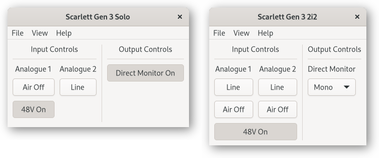

# ALSA Scarlett2 Control Panel

## Small Scarlett 3rd Gen Interfaces

The Scarlett 3rd Gen Solo and 2i2 interfaces have just a few buttons to control
the Air, Line, Phantom Power, and Direct Monitor settings. Mostly
nothing that you can’t access from the front panel anyway.

## Input Controls

### Air

Enabling Air will transform your recordings and inspire you while
making music.

### Inst

The Inst buttons are used to select between Mic/Line and Instrument
level/impedance. When plugging in microphones or line-level equipment
(such as a synthesizer, external preamp, or effects processor) to the
input, set it to “Line”. The “Inst” setting is for instruments with
pickups such as guitars.

### 48V (Phantom Power)

Turning the “48V” switch on sends “Phantom Power” to the XLR
microphone input(s). This is required for some microphones (such as
condensor microphones), and damaging to some microphones (particularly
vintage ribbon microphones).

## Output Controls

### Direct Monitor

Direct Monitor sends the analogue input signals to the analogue
outputs for zero-latency monitoring.

On the 2i2, you have the choice of Mono or Stereo monitoring when you
click the button. Mono sends both inputs to the left and right
outputs. Stereo sends input 1 to the left, and input 2 to the right
output.

## Startup Controls

#### Phantom Power Persistence

By default, phantom power is turned off when the interface is turned
on. This can be changed in the startup configuration (menu option View
→ Startup).

The one control not accessible from the front panel is “Phantom Power
Persistence” (menu option View → Startup) which controls the Phantom
Power state when the interface is powered on.

