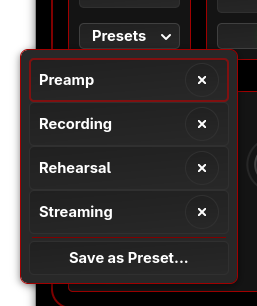

# Presets and Configuration Files

alsa-scarlett-gui provides two ways to save and restore your
interface configuration: quick presets for frequent use, and
file-based save/load for backup and sharing.

## Presets Button

The Presets button in the main window provides quick access to
named configurations for your interface.



Click the button to show a popover with:

- **Saved presets** — Click any preset name to load it
  immediately
- **Delete button** — The × button next to each preset
  removes it permanently
- **Save as Preset...** — Opens a dialog to save the current
  configuration with a name

Presets are stored per-device (identified by serial number)
in `~/.config/alsa-scarlett-gui/`. Each preset is a `.conf`
file named `{serial}-{name}.conf`.

### Use Cases

- Save different configurations for recording, mixing, and
  streaming
- Quick recall of routing setups for different projects
- Store differently-calibrated monitor group settings

## File Menu

The File menu provides save/load functionality with file
dialogs.

### Save Configuration (Ctrl-S)

File → Save Configuration opens a file dialog to save your
current settings. Two formats are available:

| Format | Extension | Description |
|--------|-----------|-------------|
| Native | `.conf` | Saves all settings (recommended) |
| alsactl | `.state` | ALSA controls only |

The native format is the default and is recommended because
it captures your complete configuration — including custom
port names, port visibility (show/hide), stereo linking, and
DSP filter parameters. These settings are managed by
alsa-scarlett-gui and stored locally, so the alsactl format
(which only saves kernel-level ALSA controls) cannot include
them.

The alsactl format is useful for interface simulation
(File → Interface Simulation), which lets you explore the
GUI for a device you don't have connected.

### Load Configuration (Ctrl-O)

File → Load Configuration opens a file dialog to restore
settings from a saved file. Both `.conf` and `.state`
formats are supported.

Loading a configuration immediately applies all settings to
your interface — routing, mixer levels, input/output
settings, custom names, and visibility.

## Native Format

The native `.conf` format uses GLib key-file (INI-style)
syntax:

```ini
[device]
serial=ABCD1234567890
model=Scarlett 18i20 USB

[controls]
Clock Source Capture Enum=Internal
Analogue Output 01 Playback Enum=Mix A
Mix A Input 01 Playback Volume=-6
...
```

The format stores:

- Boolean values as `true`/`false`
- Enum values by name (e.g., `Internal`, `Mix A`)
- Integer values in the driver's native scale
- Custom names as text strings

## Sharing Configurations

Configuration files can be shared between users or machines:

- The serial number in the file is for reference only —
  files can be loaded on any compatible interface
- Controls that don't exist on the target interface are
  silently ignored
